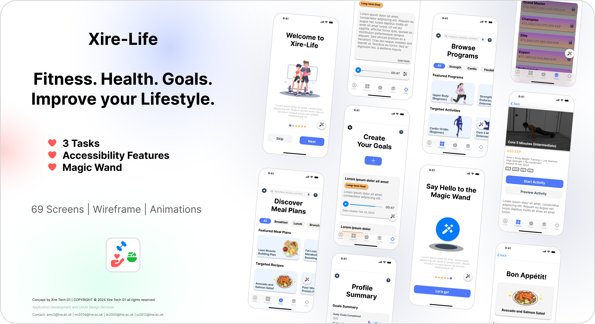
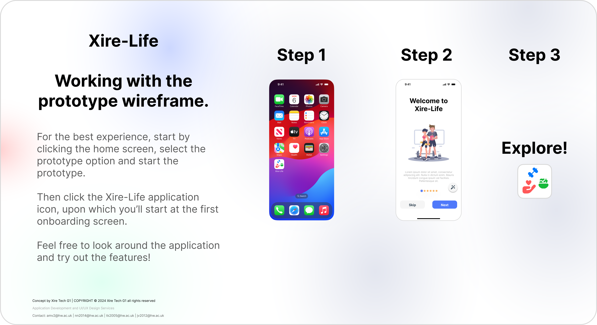

# Xire-Life: Health and Fitness App Prototype

## Project Overview

Xire-Life is a prototype for a health and wellness application designed to help users achieve their lifestyle goals in an interactive and engaging way. This project, created using Figma, focuses on addressing the growing need for at-home fitness and wellness solutions, especially in light of the sedentary lifestyles and challenges brought on by the COVID-19 pandemic.

## Features and Highlights

The Xire-Life app prototype includes the following features:

- **Task Variety**: Users can participate in three distinct tasks to improve their lifestyle. These tasks are designed to be both engaging and effective.
- **Accessibility**: The prototype emphasizes accessibility through features like easy navigation, reachability, visual clarity, language preferences, and closed captions.
- **User-Centric Design**: The app's design is guided by concepts from human-computer interaction (HCI), ensuring that the user experience is intuitive and effective.
- **Interactivity**: The prototype provides a fun and interactive approach to meeting health and fitness goals.

## Project Details

This project explores various stages of app development, including:

- **Requirements Gathering and Planning**: Background research and literature review to identify functional and non-functional requirements.
- **Use Cases and Personas**: Development of use-cases, personas, and storyboards to guide the design process.
- **Design Decisions**: Detailed discussion of the design choices made, the principles of HCI applied, and how these contribute to advanced interaction design.

## Prototype

The prototype is available in a Figma file, showcasing the visual design, user interface, and interactions of the Xire-Life app. It serves as a detailed representation of how the final app could look and function.

## Getting Started

To view the prototype:

1. [Visit Figma](https://www.figma.com/)
2. Open the Figma file link: `xire-life.fig`

## Project Structure

The project is organized as follows:

- **Background Research**: Documentation on the literature reviewed and requirements gathered.
- **Design Artifacts**: Includes personas, storyboards, and use-case diagrams.
- **Prototype**: The interactive design of the Xire-Life app.

## Sample Images

Cover Image

Usage

## Conclusion

Xire-Life is more than just a prototype; it’s a comprehensive approach to designing an app that meets modern health and fitness needs. The emphasis on user experience, accessibility, and interactivity ensures that this app can make a meaningful impact on users' lives.

---

Thank you for exploring the Xire-Life prototype. We hope this design inspires and informs your approach to creating health and wellness applications.
